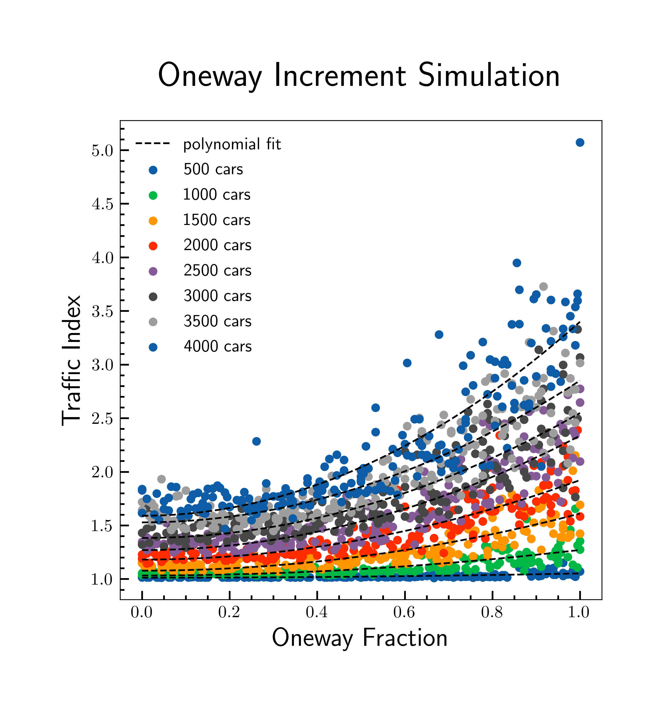
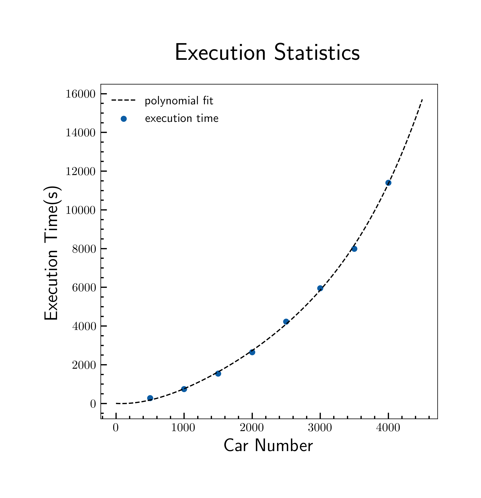
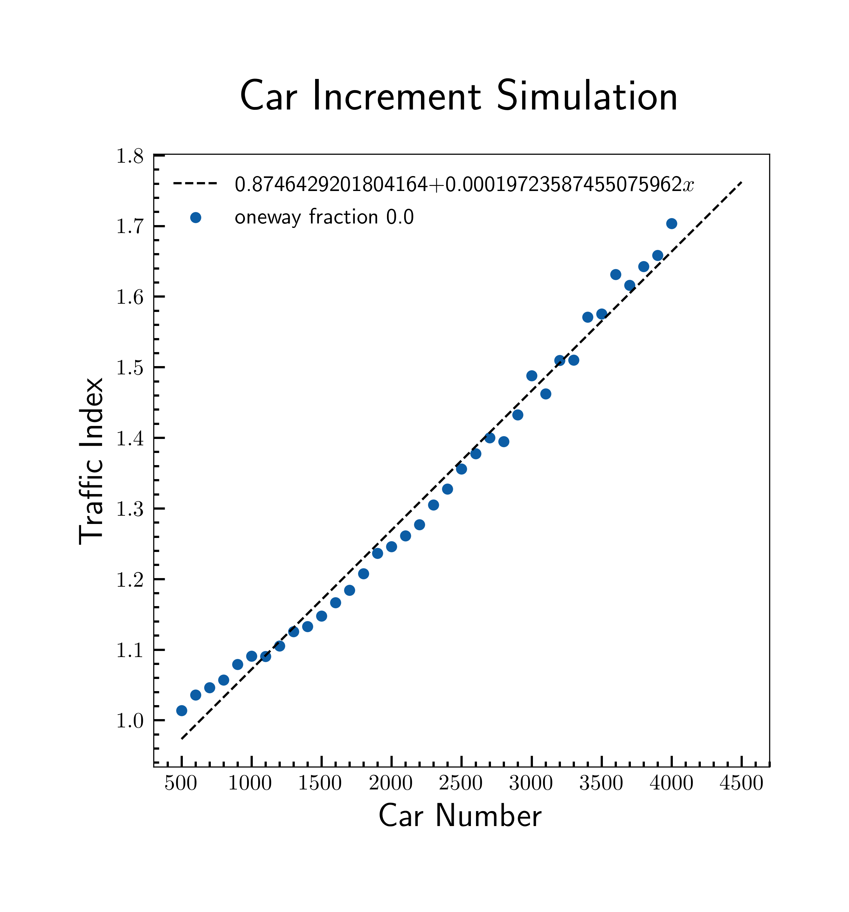
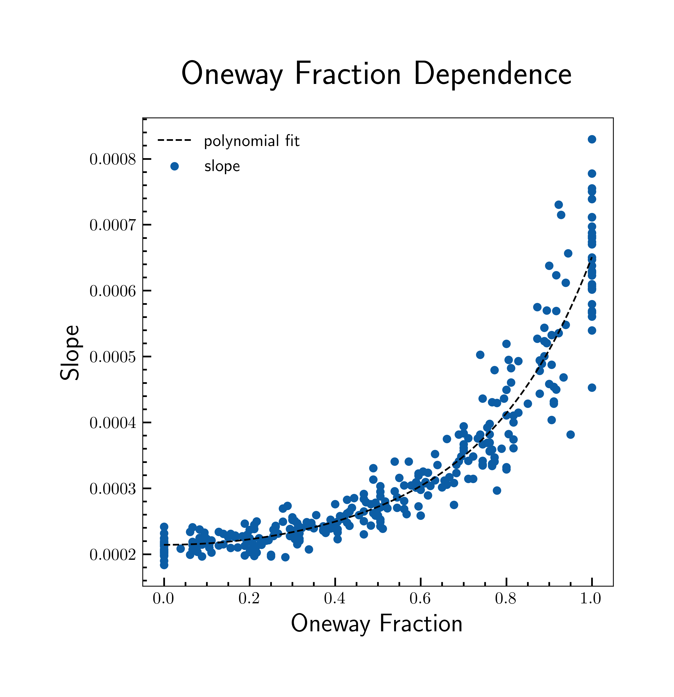
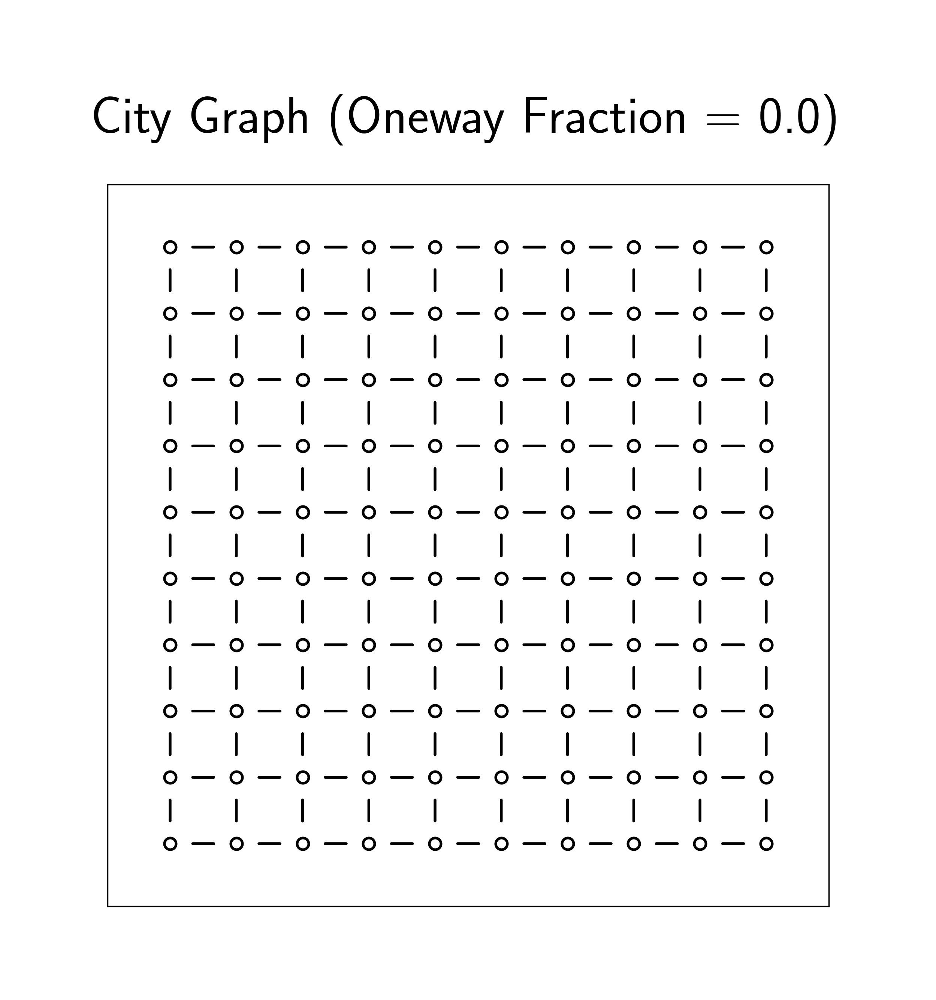

<h1>TRAFFIC SIMULATION</h1>

<i> The simulations are not strictly about traffic, more about a really special random walk where any individuals has a destination and knows the shortest path thereto, with the rule that only one individual can occupy one slot of the road, i.e. a traffic generating rule.</i>

<h2>Oneway Increment Simulation</h2>

In the image below we see the results of a simulation of traffic increasing the fraction of oneway roads in a 10x10 grid-like city, 
with roads that can contain from 5 to 30 cars per way with a gaussian
distribution of mean 20 and sigma 10.

The traffic index is the ratio mean_steps+mean_stops/mean_steps averaged on every car. In a real city this would be the ratio journey_time/ideal_journey_time averaged on every car.
A polynomial fit of degree 2 is done, in order to draw the lines and make the graph more readable we do not expect a valuable result from it.

The execution time of the <strong>oneway increment simulation</strong> grows pretty fast increasing the number of cars.

 

<h2>Car Increment Simulation</h2>

In the image below we see the results of a simulation of traffic increasing the number of cars in the same 10x10 grid-like city, 
with roads that can contain from 5 to 30 cars per way with a gaussian
distribution of mean 20 and sigma 10.

 In general we can notice a linear dependence, below a plot of its slope increasing the oneway fraction

The cities are so far created as grid graphs with a fraction of oneway roads, as drawn below.

<h2> Further developments :</h2>
<ul>
  <li><strong>In mv_car use add_car and rm_car, since we forgot</strong></li>
  <li>Human readable interface (this one is pretty rough)</li>
  <li><s>Car increment simulation</s></li>
  <li>Different path generation modes (in->out, out->in, user selection, random)</li>
  <li> Simulation mode random walk</li>
  <li> In counting the car density one should not count the road adjacent to the cut off nodes, and we could see if this clears the data dispersion for high oneway fractions</li>
  <li>Threads</li>
  <li>Graphics :
    <ul>
      <li>Print coloured roads(car_number/road_length)</li>
      <li>js reads from cpp</li>
      <li>js reads from files</li>
      <li>User selects source and destination sets (click or area selection)</li>
    </ul>
  </li>
  <li>Add semaphores</li>
  <li>Remove or add roads in the grid</li>
  <li>Geojson</li>
  <li>Learn semaphore duty cycle minimizing traffic index via GDL</li>
  <li>Remove nodes from the city</li>
  <li>Split cars in two groups with different removed nodes</li>
  <li>Genetic driver selection (Russian driver gene)</li>
</ul>
